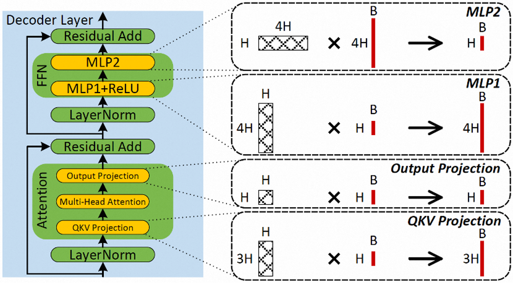
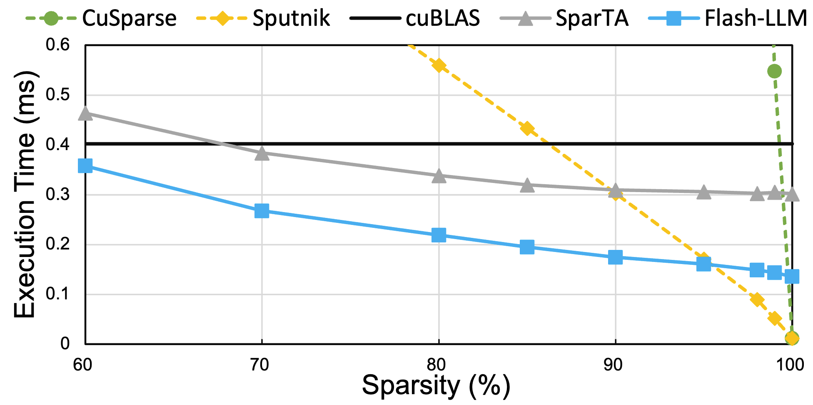
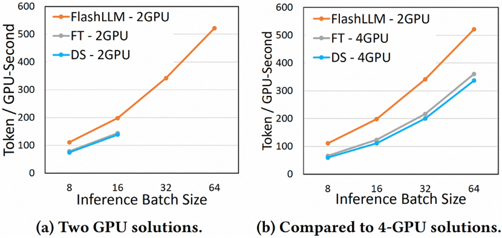
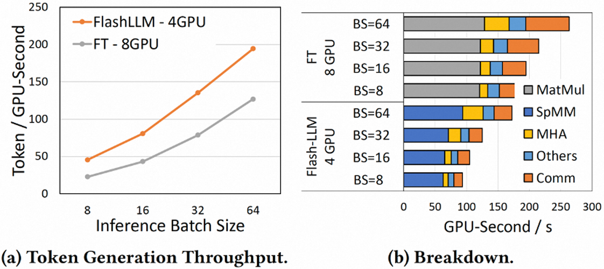

# Flash-LLM
Flash-LLM is a large language model (LLM) inference acceleration library for unstructured model pruning. Flash-LLM mainly contains efficient GPU code based on Tensor-Core-accelerated unstructured sparse matrix multiplication calculations, which can effectively accelerate the performance of common matrix calculations in LLM. With Flash-LLM, the pruned LLM models can be deployed onto GPUs with less memory consumption and can be executed more efficiently. Currently, the code has been evaluated on NVIDIA A100 GPUs.

We observe that LLM inference performance and memory usage are heavily bounded by four types of **Skinny MatMuls** shown in the left figure. 
Flash-LLM aims to optimize the four MatMuls based on the key approach called **"Load-as-Sparse and Compute-as-Dense" (LSCD)**.

<p align="center">
  <picture>
  
  </picture>
  <picture>
  
  </picture>
</p>

## Getting Started
Visit the [documentation](docs) to get started.
* [Preparations](docs/1_Preparations.md)
* [Kernel Benchmarking](docs/2_KernelBenchmarking.md)
* [LLM Inference Example](docs/3_LLMInferenceExample.md)

## Performance
Flash-LLM shows superior performance in both single SpMM kernel and end-to-end LLM inference.
The figure below shows the kernel-level performance comparisons among Flash-LLM and state-of-the-art solutions.
Flash-LLM outperforms Sputnik/SparTA by **3.6x**/**1.4x**, **3.0x**/**1.4x**, and **2.0x**/**1.6x** under 70%, 80%, and 90% sparsity respectively. 
Besides, Flash-LLM can also outperform the state-of-the-art dense kernels cuBLAS with Tensor Core enabled by **1.4x**, **1.7x**, and **2.1x**.

The figure below on the **left** shows the performance of Flash-LLM, FasterTransformer, and DeepSpeed respectively on the **OPT-66B** models. 
First of all, Flash-LLM can support larger batch sizes because it requires less storage resources; secondly, Flash-LLM has significantly higher token generation efficiency than FasterTransformer and DeepSpeed; finally, Flash-LLM often requires fewer GPUs to execute the same LLM model.

The figure below on the **right** presents the performance of Flash-LLM and FasterTransformer respectively on the **OPT-175B** models and the memory breakdown for the inference.
On the one hand, Flash-LLM's matrix calculation is more efficient; on the other hand, its communication cost is lower because it requires fewer GPUs.

<p align="center">
  <picture>
  
  </picture>
  <picture>
  
  </picture>
</p>
 
## Citation
If you use this codebase or otherwise found our work valuable, please cite:
```bibtex
@inproceedings{flashllm2024,
  title={Flash-LLM: Enabling Cost-Effective and Highly-Efficient Large Generative Model Inference with Unstructured Sparsity}, 
  author={Haojun Xia and Zhen Zheng and Yuchao Li and Donglin Zhuang and Zhongzhu Zhou and Xiafei Qiu and Yong Li and Wei Lin and Shuaiwen Leon Song},
  booktitle={Proceedings of the VLDB Endowment 17},
  year={2024}
}
```